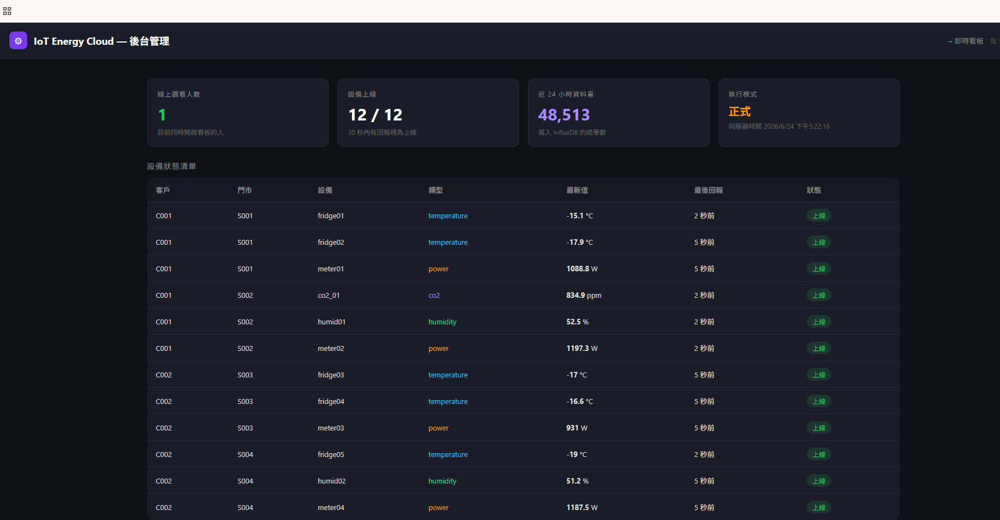

# 11 — 後台管理介面

後台管理介面（`admin.html`）給營運/管理者快速掌握系統即時狀態：誰在看、設備是否正常、資料量多少。

🔗 線上版：https://yorroy123.github.io/iot-energy-cloud/admin.html

---

## 介面預覽



---

## 功能說明

### 上方四張狀態卡

| 卡片 | 內容 | 資料來源 |
|---|---|---|
| **線上觀看人數** | 目前同時開啟看板的連線數 | `ws_manager.count()` |
| **設備上線** | 上線數 / 總數（30 秒內有回報＝上線）| InfluxDB `last()` |
| **近 24 小時資料量** | 寫入 InfluxDB 的總筆數 | InfluxDB `count()` |
| **執行模式** | DEMO（模擬）/ 正式，加伺服器時間 | 後端設定 |

### 系統資源卡片

監控後端伺服器本身的健康狀況（透過 `psutil` 讀取）：

| 卡片 | 內容 |
|---|---|
| **後端記憶體 (RAM)** | 程序實際佔用 MB（免費版上限 512 MB）|
| **系統 CPU 使用率** | 主機 CPU %（免費版僅 0.1 核，偏高即瓶頸）|
| **系統記憶體使用率** | 主機整體記憶體占用 % |
| **後端運行時間** | 距上次部署 / 冷啟動的時間 |

### 線上連線清單（可踢除）

逐條列出目前所有 WebSocket 連線：**連線 ID、來源 IP、連線時長**，每條旁邊有「踢除」按鈕。  
此設計參考 **EMQX Dashboard 的 Clients 頁面**——列出所有連線並可逐一中斷。

### 下方設備狀態清單

逐台列出 12 台設備：客戶、門市、設備代號、類型、**最新值**、**最後回報時間**、**上線/離線**狀態。  
每 **5 秒自動更新**一次，不需手動重整。

---

## 「線上觀看人數」是怎麼算的？（重要）

**它算的是「目前同時開著的 WebSocket 連線數」，不是 IP、也不是不重複的人。**

| 情境 | 計算結果 |
|---|---|
| 同一台電腦開 3 個分頁 | **3**（每個分頁一條連線）|
| 3 台不同電腦各開 1 個 | 3 |
| 1 個人開著看板放 1 小時 | 持續算 1，關掉才減 |

### 為什麼？

每個看板分頁載入時會產生一個**隨機 client_id**（`dash-xxxxxxxx`），  
後端用這個 id 當 key 記錄連線。連入時 +1、離線時 −1，並即時廣播給所有人。

> 早期版本所有分頁都用固定 id `dashboard`，導致後者覆蓋前者，人數永遠是 1——  
> 這個 bug 已修正（見 commit 紀錄）。

### 如果想改成「按 IP 去重」

可在後端 WebSocket 端點讀取 `websocket.client.host` 取得來源 IP，  
以 IP 為 key 去重即可讓「同一台電腦多分頁只算 1」。本專案目前未這樣做（Demo 以連線數為準）。

---

## 後端端點

### `GET /stats`

輕量端點，只回線上人數：

```json
{ "online": 3 }
```

### `GET /admin/overview`

後台主要資料來源，彙總所有狀態：

```json
{
  "online_viewers": 3,
  "demo_mode": false,
  "device_count": 12,
  "devices_online": 12,
  "total_points_24h": 48513,
  "server_time": "2026-06-24T09:22:16+00:00",
  "system": {
    "cpu_percent": 12.3,
    "mem_used_mb": 78.5,
    "mem_percent": 41.2,
    "uptime_seconds": 3600
  },
  "devices": [
    {
      "device_uid": "fridge01",
      "device_type": "temperature",
      "customer_id": "C001",
      "site_id": "S001",
      "value": -15.1,
      "last_seen": "2026-06-24T09:22:14+00:00",
      "is_online": true
    }
  ]
}
```

> 此端點直接查 InfluxDB（不依賴 PostgreSQL），所以即使 PG 沒有種子資料也能完整運作。

### `GET /admin/clients`

目前所有線上連線清單：

```json
{
  "protected": true,
  "clients": [
    { "client_id": "dash-a1b2c3d4", "ip": "203.0.113.5", "connected_seconds": 142 }
  ]
}
```

### `POST /admin/kick/{client_id}`

踢除指定連線。若後端有設定 `ADMIN_KEY`，需在 `X-Admin-Key` 標頭帶金鑰：

```
POST /admin/kick/dash-a1b2c3d4
X-Admin-Key: <你的 ADMIN_KEY>
```

回應：`{ "status": "kicked", "client_id": "dash-a1b2c3d4" }`

被踢的看板 WebSocket 會收到關閉碼 `4001`，前端的自動重連機制會讓它嘗試重新連線。  
（若要永久封鎖，需進一步做 IP 黑名單，本專案未實作。）

### 管理金鑰 `ADMIN_KEY`

| 情境 | 行為 |
|---|---|
| 未設定 `ADMIN_KEY` | 踢人無保護（任何人可踢，僅適合純 Demo）|
| 已設定 `ADMIN_KEY` | 踢人需帶正確金鑰，後台會提示輸入並存在瀏覽器 localStorage |

> 設定方式：在 Render 後端的環境變數加 `ADMIN_KEY=你的密碼`。

---

## 前後端如何串接

```
admin.html ──fetch every 5s──→ GET /admin/overview ──查──→ InfluxDB
   │                                                          │
   └──────────── 渲染卡片 + 設備表格 ←── JSON 回應 ←──────────┘
```

`admin.html` 的後端網址透過 GitHub Actions 部署時自動注入（把 `http://localhost:8000`  
替換成 Render 後端網址），所以同一份檔案本機與雲端都能用。  
也可手動覆寫：`admin.html?backend=https://你的後端`

---

## ⚠️ 安全注意

**目前後台沒有密碼保護**——任何人知道網址都能看到設備狀態。

- Demo / 內部展示：可接受
- 正式對外：建議加上其中一種保護
  1. 後端對 `/admin/*` 加 API Key 或 Basic Auth 檢查
  2. 前端加簡單登入頁（擋一般人，但前端驗證不算真正安全）
  3. 把後台部署在需登入的內網／VPN 後面

要加登入保護可再擴充——後端只需在 `/admin/overview` 與 `/stats` 加一道 `Depends` 驗證即可。

---

## 相關檔案

- 後台頁面：[`admin.html`](../admin.html)
- 後端端點：[`backend/main.py`](../backend/main.py)（`/stats`、`/admin/overview`）
- 連線管理：[`backend/ws_manager.py`](../backend/ws_manager.py)（`count()`）
